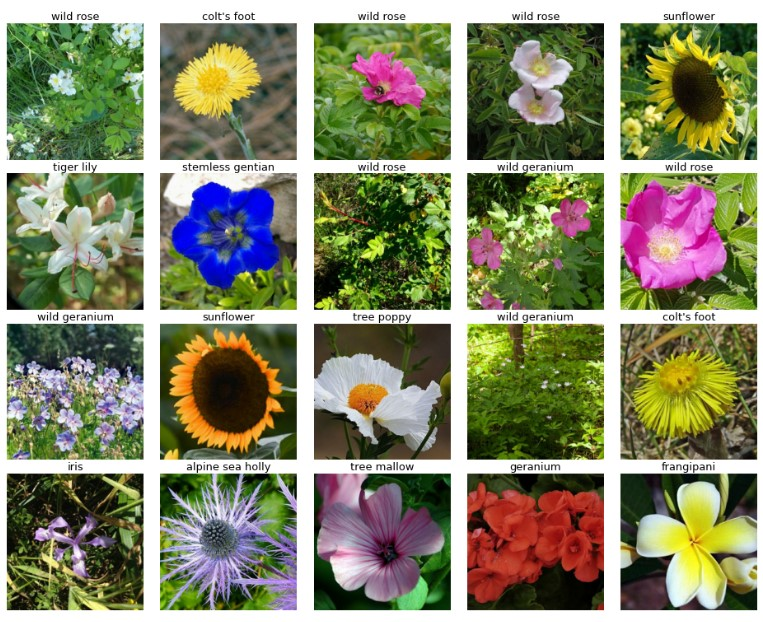

## CMPE 257: Machine Learning   Team 11
 

## Welcome to the Petals to the Metal competition! 
The challenge for this competition was to build a machine learning model to classify 104 types of flowers based on their images.

Our code demonstrate the use of TPU's with Transfer Learning to achieve a high accuracy model.

Below are some of the flowers we are trying to predict using our model:    

