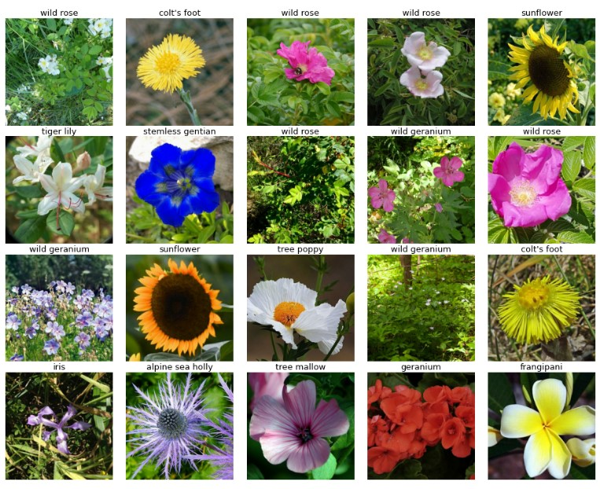
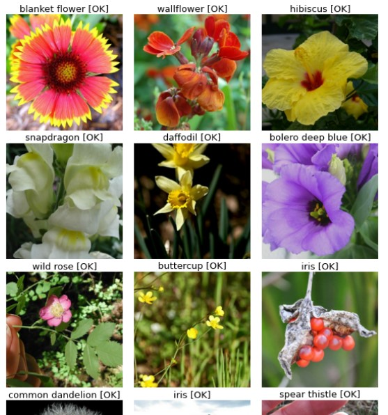

## CMPE 257: Machine Learning   Team 11
 

## Welcome to the Petals to the Metal competition! 
The challenge for this competition was to build a machine learning model to classify 104 types of flowers based on their images.

Our code demonstrate the use of TPU's with Transfer Learning to achieve a high accuracy model.

Below are some of the flowers we are trying to predict using our model:    

Below is the summary of models experimented on this dataset

| Number | Pre-trained Model | Num of epochs | Time taken per Epoch | Accuracy on Validation Set |
| --- | --- | --- | --- | --- |
| 1 | VGG19 | 10 | 220 seconds | 92.17% |
| 2 | EfficentNet | 10 | 472 seconds | 96.36% |
| 3 | DenseNet | 10 | 262 seconds | 97.59%  |
| 4 | ResNet | 10 | 188 seconds | 96.98%  |
| 5 | Xception | 10 | 171 seconds | 98.65% |

Best Model with highest score - 97.334% Score
The best prediction on unseen data came from an Ensemble of EfficientNet and DenseNet and the Notebook is :
[Group-11-flower-classification-best-score-version-0.97334](Group-11-flower-classification-best-score-version-0.97334)

Some of the valid predictions from our ensemble model of EfficientNet and DenseNet are:

